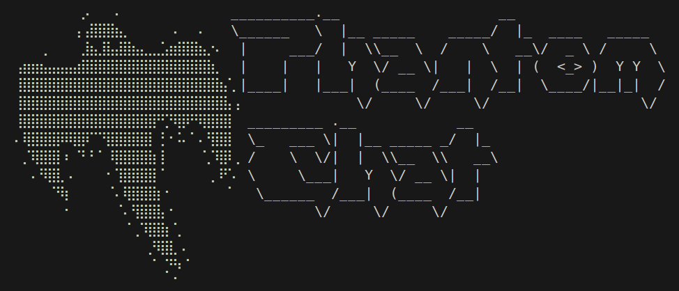

# Phantom Chat

This is an RSA encrypted chat with 3072-bit keys where you can choose whether to start a P2P (peer to peer) chat, in case you are on the same subnet, or create a client-server pattern if you want to talk and you are in two different subnets.




---

## Requirements

- Python 3.x

---

## Installation

1. Clone the repository or download the Python file.
2. Create venv:
```bash
python3 -m venv venv
```
3. Activate venv:
```bash
source venv/bin/activate
```
4. Install dependencies:
```bash
pip install -r requirements.txt
```